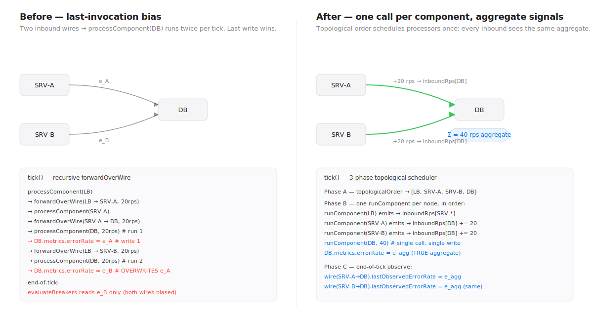
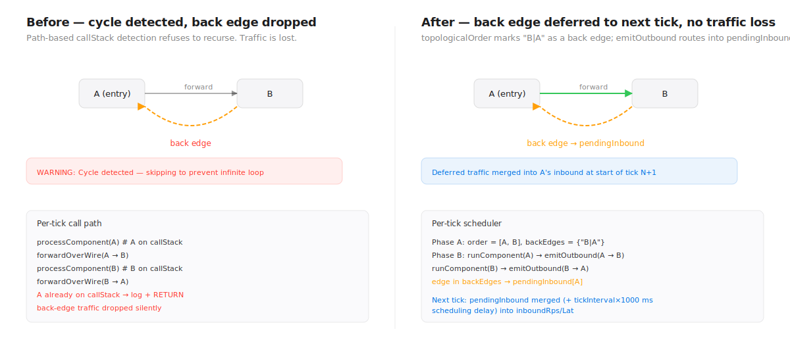

# SystemSim — Knowledge Base

Business logic to code mapping. If you want to know "where does X happen in the codebase," start here.

Treat this as the **onboarding doc**. It maps product intent to file paths, function names, and the flow of control between them. When behavior changes, update this file too (or the map rots).

---

## Table of Contents

1. [What SystemSim is](#what-systemsim-is)
2. [High-level architecture](#high-level-architecture)
3. [Business logic flows](#business-logic-flows)
    - [User opens the app](#flow-1-user-opens-the-app)
    - [User imports a diagram image](#flow-2-user-imports-a-diagram-image-vision-to-intent)
    - [User writes functional requirements and API contracts](#flow-3-user-writes-requirements-and-api-contracts-design-flow)
    - [User runs a simulation](#flow-4-user-runs-a-simulation)
    - [User clicks Run Stressed](#flow-5-user-clicks-run-stressed)
    - [User sees a preflight error and clicks to fix it](#flow-6-preflight-routing)
    - [Simulation completes and debrief appears](#flow-7-post-run-debrief-deterministic--ai)
    - [User downloads the debrief report](#flow-8-user-downloads-the-debrief-report)
4. [Subsystem map](#subsystem-map)
    - [Simulation engine](#simulation-engine)
    - [Store (Zustand)](#store-zustand)
    - [AI debrief](#ai-debrief)
    - [Design flow](#design-flow)
    - [Preflight](#preflight)
    - [Vision-to-Intent](#vision-to-intent)

---

## What SystemSim is

**SystemSim** is a distributed-systems-design simulator. It's Logisim for backend architecture. Users drop components on a canvas (servers, databases, caches, queues), wire them together, define traffic profiles and API contracts, then run a tick-based stochastic simulation that surfaces realistic failure modes: cache stampede, hot shards, queue overflow, connection pool exhaustion, ρ-based queueing collapse.

The thesis: runtime fidelity is the moat. Every competitor can draw boxes. Only we run the boxes.

---

## High-level architecture

```
┌────────────────────────────────────────────────────────────────┐
│                          BROWSER (SPA)                          │
│                                                                 │
│  ┌──────────┐  ┌─────────┐  ┌────────┐  ┌─────────────────┐  │
│  │ Landing  │→ │ Design  │→ │ Canvas │  │ SimulationEngine│  │
│  │  Page    │  │  Flow   │  │+XyFlow │◄─│ (tick-based)    │  │
│  └──────────┘  └─────────┘  └────┬───┘  └─────────────────┘  │
│                                  │                             │
│                    ┌─────────────┴──────────────┐              │
│                    │        Zustand Store        │              │
│                    │  (nodes/edges/metrics/log)  │              │
│                    └─────────────┬──────────────┘              │
│                                  │                             │
│          ┌───────────────────────┼───────────────────────┐    │
│          ▼                       ▼                       ▼    │
│    ┌──────────┐          ┌────────────┐           ┌──────────┐│
│    │ BottomPl │          │ Preflight  │           │ AI debrf ││
│    │ (log/dbf)│          │  Banner    │           │ (async)  ││
│    └──────────┘          └────────────┘           └────┬─────┘│
└────────────────────────────────────────────────────┬───┼──────┘
                                                     │   │
                                                     ▼   ▼
                                           ┌──────────────────────┐
                                           │  Vercel Edge (API)   │
                                           │  /api/debrief        │
                                           │  /api/describe-intent│
                                           │  /api/generate-diagram│
                                           └──────────┬───────────┘
                                                      │
                                                      ▼
                                           ┌──────────────────────┐
                                           │  Anthropic API       │
                                           │  (Claude models)     │
                                           └──────────────────────┘
```

**Key principles:**
- **Single source of truth**: [src/store/index.ts](src/store/index.ts). All UI state, graph state, simulation state, preflight state lives here.
- **Simulation runs in the browser.** No backend simulation. [src/engine/SimulationEngine.ts](src/engine/SimulationEngine.ts) holds the full tick-based engine. Backend is only for LLM calls.
- **LLM is optional enhancement, not hard dependency.** Deterministic debrief ships immediately; AI questions merge in async via [src/ai/anthropicDebrief.ts](src/ai/anthropicDebrief.ts). On timeout/error, users still see a full debrief.
- **Store exposed on `window.__SYSTEMSIM_STORE__`** for Playwright E2E tests ([src/store/index.ts](src/store/index.ts#L1-L5)).

---

## Business logic flows

### Flow 1: User opens the app

**Business logic:** First-time user lands on a picker: Discord scenario, freeform template, or text/image-to-diagram input.

**Code flow:**

```
User → browser loads / → index.html → src/main.tsx (mount React)
    → App.tsx (routes by appView state)
        → appView === 'landing' → LandingPage.tsx
            [user clicks template or types intent]
            → handles click:
                - Template path: replaceGraph() + setAppView('canvas')
                - Discord path: setAppMode('scenario') + setAppView('design')
                - Text/image path: UnifiedInput → POST /api/describe-intent
```

**Files:**
- [src/main.tsx](src/main.tsx) — React entry, creates root
- [src/App.tsx](src/App.tsx) — view router (landing / design / review / canvas)
- [src/components/ui/LandingPage.tsx](src/components/ui/LandingPage.tsx) — `startScenario()` kicks Discord path, `startFreeform()` goes to freeform, `handleTemplateApply()` injects template graph
- [src/components/ui/TemplatePicker.tsx](src/components/ui/TemplatePicker.tsx) — loads `/public/templates/*.json`, displays thumbnails
- [src/components/ui/UnifiedInput.tsx](src/components/ui/UnifiedInput.tsx) — text + image input; POST to `/api/describe-intent`

### Flow 2: User imports a diagram image (vision-to-intent)

**Business logic:** User has an existing Miro/Figma/Excalidraw diagram. They paste or upload it, we extract intent + components + connections, and let them review before committing.

**Code flow:**

```
User drops image → ImagePasteZone.tsx (client-side resize via util/imageResize.ts)
    → UnifiedInput.tsx onSubmit
        → POST /api/describe-intent { text?, image? }
            → api/describe-intent.ts
                → validates image (MIME, magic bytes, size)
                → calls Claude Opus 4.6 vision with DESCRIBE_INTENT_TOOL_SCHEMA
                → returns { intent, systemSpec, confidence }
        → store.setIntent(intent) + store.setSystemSpec(spec)
        → setAppView('review')
    → ReviewMode.tsx renders intent + editable connections
        → user edits, clicks "Derive components" → replaceGraph + setAppView('canvas')
```

**Files:**
- [src/components/ui/UnifiedInput.tsx](src/components/ui/UnifiedInput.tsx) — the input field + attach
- [src/components/ui/ImagePasteZone.tsx](src/components/ui/ImagePasteZone.tsx), [src/components/ui/ImagePreviewChip.tsx](src/components/ui/ImagePreviewChip.tsx) — upload UX
- [src/util/imageResize.ts](src/util/imageResize.ts) — client-side resize to 1568px JPEG before upload
- [src/ai/describeIntent.ts](src/ai/describeIntent.ts) — client-side wrapper for the fetch call
- [src/ai/describeIntentPrompt.ts](src/ai/describeIntentPrompt.ts), [src/ai/describeIntentSchema.ts](src/ai/describeIntentSchema.ts) — prompt + Zod schema
- [api/describe-intent.ts](api/describe-intent.ts) — Edge Function
- [api/_shared/imageValidation.ts](api/_shared/imageValidation.ts) — MIME + magic-byte check
- [src/components/ui/ReviewMode.tsx](src/components/ui/ReviewMode.tsx) — intent + components + connections editor
- [src/components/ui/ConfidencePanel.tsx](src/components/ui/ConfidencePanel.tsx) — displays confidence breakdown

### Flow 3: User writes requirements and API contracts (design flow)

**Business logic:** Before running a simulation, the user should be able to declare functional requirements, non-functional requirements (SLOs), API contracts (with auth + ownerServiceId), and a data schema.

**Code flow:**

```
User clicks "Design Flow" tab in toolbar → setAppView('design')
    → DesignFlow.tsx (full-page)
        → Section 1: Requirements (functional + NFRs)
        → Section 2: API Contracts (method, path, authMode, ownerServiceId)
        → Section 3: Schema (paste SQL-like text → parseSchemaLocally → SchemaEntity[])
        → Section 4: Auto-generate endpoint routes
            → store.setApiContracts(contracts)
                → internal: runs BFS from owner service, builds EndpointRoute[]
        → onComplete → setAppView('canvas')
```

**Files:**
- [src/components/panels/DesignFlow.tsx](src/components/panels/DesignFlow.tsx) — full-page multi-section editor
- [src/components/panels/designFlowParser.ts](src/components/panels/designFlowParser.ts) — `parseSchemaLocally()` turns pasted schema text into `SchemaEntity[]`
- [src/components/panels/DesignPanel.tsx](src/components/panels/DesignPanel.tsx) — inline version that lives in the CanvasSidebar
- [src/components/panels/CanvasSidebar.tsx](src/components/panels/CanvasSidebar.tsx) — tabbed sidebar with Components / Design / Traffic

**Store entry points:**
- `setFunctionalReqs`, `setNonFunctionalReqs`
- `setApiContracts` — the setter rebuilds `EndpointRoute[]` via BFS if `ownerServiceId` is set ([src/store/index.ts](src/store/index.ts))
- `setSchemaMemory` — sets schema + triggers downstream preflight

### Flow 4: User runs a simulation

**Business logic:** Given a canvas with components + wires + traffic profile + preflight clean, user clicks Run. The simulation ticks once per second of sim-time, updates live metrics per component, and emits log entries. At completion, generates a debrief.

**Code flow:**

```
User clicks Run → Toolbar.handleRun()
    → checkForHints(nodes, edges, scenarioId) → emits hint cards
    → startSimulation(profile, stressedMode=false)  [src/engine/useSimulation.ts]
        → new SimulationEngine(nodes, edges, profile, ..., stressedMode)
        → setInterval(runTick, 1000/simulationSpeed)
            → runTick() loop:
                → engine.tick()
                    → getCurrentRps() → current phase RPS
                    → for each entry node, processComponent(id, rps, 0)
                        → recursively walks graph via forwardToDownstreams
                        → per component type: processServer/Cache/Queue/Database/...
                        → each sets state.metrics.{p50, p99, cpuPercent, errorRate, queueDepth, cacheHitRate}
                        → fires saturation callouts via fireCallout() when thresholds cross
                    → updateParticles() — visual particle physics for wires
                    → updateComponentHealth() — healthy/warning/critical/crashed
                    → throttled logs pushed to this.log
                    → returns { metrics, healths, newLogs, particles, time }
                → updateLiveMetrics(componentId, metrics) — fills store.liveMetrics[id]
                → updateComponentHealth(componentId, health) — drives node border color
                → addLogEntry(log) — appends to store.liveLog (visible in BottomPanel)
            → when engine.isComplete(): stopSimulation(runId, profile)
    → stopSimulation():
        → assembles SimulationRun from metricsHistory + log + stressedMode
        → addSimulationRun(run)
        → generateDebrief(ctx) → sets store.debrief (deterministic, instant)
        → fetchAIDebrief(summary) async → merges aiQuestions when ready
        → setBottomPanelTab('debrief')
```

**Files:**
- [src/components/ui/Toolbar.tsx](src/components/ui/Toolbar.tsx) — Run / Run Stressed / Pause / Resume buttons
- [src/engine/useSimulation.ts](src/engine/useSimulation.ts) — the React-hook driver with `startSimulation`, `runTick`, `stopSimulation`
- [src/engine/SimulationEngine.ts](src/engine/SimulationEngine.ts) — the tick engine itself (see Subsystem map below)
- [src/store/index.ts](src/store/index.ts) — setters: `updateLiveMetrics`, `updateComponentHealth`, `addLogEntry`, `addSimulationRun`, `setDebrief`

### Flow 5: User clicks Run Stressed

**Business logic:** One-shot worst-case run. Same topology, but (a) peak phase RPS is held for the full duration, (b) caches and CDNs are forced cold (hitRate=0, no warmup, no stampede), (c) wire latency is always p99 (base + full jitter).

**Code flow:**

```
User clicks Run Stressed → Toolbar.handleRunStressed()
    → startSimulation(profile, stressedMode=true)
        → new SimulationEngine(..., stressedMode=true)
            → getCurrentRps(): returns max(phases.rps) regardless of tick
            → getWireLatency(): returns latencyMs + jitterMs (no sampling)
            → processCache / processCdn: forces hitRate=0, skips stampede logging
    → stopSimulation stamps run.stressedMode=true
    → BottomPanel DebriefContent shows "Stressed run · peak RPS held + cold cache + wire p99" badge
```

**Files:**
- [src/components/ui/Toolbar.tsx](src/components/ui/Toolbar.tsx#L81-L103) — `handleRun` and `handleRunStressed` handlers
- [src/engine/useSimulation.ts](src/engine/useSimulation.ts) — `startSimulation` accepts `stressedMode` param, threads it into `SimulationEngine`
- [src/engine/SimulationEngine.ts](src/engine/SimulationEngine.ts) — `stressedMode` field, `getCurrentRps`, `getWireLatency`, `processCache`, `processCdn` branches
- [src/components/panels/BottomPanel.tsx](src/components/panels/BottomPanel.tsx) — `DebriefContent` renders stressed badge via `latestRun.stressedMode`

### Flow 6: Preflight routing

**Business logic:** Before Run is enabled, preflight checks run on every state change. If something's missing (no traffic profile, no schema, unassigned tables, etc), a banner lists the errors. Clicking an error routes the user to the exact fix location, with a pulse animation drawing the eye.

**Code flow:**

```
[every store change]
    → Toolbar re-runs runPreflight(...) via useMemo
        → preflight.ts returns { errors, warnings } each with:
            - message, tooltip
            - target: 'traffic' | 'design' | 'canvas' | 'config'
            - targetSubtab?: 'api' | 'schema'
            - targetComponentId?: string
    → if errors.length > 0: Run button disabled with tooltip "Resolve preflight items first"
    → PreflightBanner renders the errors + warnings above the canvas

User clicks a preflight item → PreflightBanner.handleClick
    → switch on item.target:
        - 'traffic': setSidebarTab('traffic') + setPulseTarget('sidebar:traffic')
        - 'design': setSidebarTab('design') + setDesignPanelTab(subtab) + pulse
        - 'config': setSelectedNodeId(targetComponentId) + pulse node
        - 'canvas': pulse all (for "no entry point" error)
    → setTimeout(1500) then clearPulseTarget
    → CanvasSidebar + SimComponentNode pick up pulseTarget and add .simfid-pulse class
```

**Files:**
- [src/engine/preflight.ts](src/engine/preflight.ts) — `runPreflight()` returns `PreflightResult`
- [src/components/canvas/PreflightBanner.tsx](src/components/canvas/PreflightBanner.tsx) — banner + click routing
- [src/store/index.ts](src/store/index.ts) — `pulseTarget`, `setPulseTarget`, `sidebarTab`, `designPanelTab` state
- [src/components/panels/CanvasSidebar.tsx](src/components/panels/CanvasSidebar.tsx) — tab buttons pulse when `pulseTarget === 'sidebar:*'`
- [src/components/nodes/SimComponentNode.tsx](src/components/nodes/SimComponentNode.tsx) — node pulses when `pulseTarget === 'node:${id}'`
- [src/index.css](src/index.css) — `.simfid-pulse` keyframe animation

### Flow 7: Post-run debrief (deterministic + AI)

**Business logic:** When the simulation completes, the user should see scores (coherence/security/performance), a per-component peak table (p50/p99/ρ/errors/queue), a list of detected patterns/flags, and 3-5 Socratic questions (deterministic + optional AI-generated).

**Code flow:**

```
engine.isComplete() → stopSimulation()
    → generateDebrief({ nodes, edges, requirements, schemaMemory, simulationRun, scenarioId })
        → runDeterministicChecks(ctx) → flags: string[]
            - API gateway without auth
            - Queue without DLQ / retry
            - DB without indexes
            - Server SPOF
            - Strong consistency + replication lag
            - Cache TTL > 1h
        → generateSocraticQuestions(ctx) → questions: string[]
            - Hot shard (from metricsTimeSeries)
            - Sync fanout (from graph structure)
            - Queue overflow / stampede / pool exhaustion (from log)
        → calculateScores(ctx, flags) → { coherence, security, performance }
            - Deducts per flag category with predefined weights
        → computePerComponentPeaks(metricsTimeSeries, nodes) → PerComponentSummary[]
            - Max of p50, p99, cpu, mem, errorRate, queueDepth per component
            - Sorted by p99 desc
        → generateSummary(ctx) → summary string
        → returns AIDebrief { summary, questions, flags, scores, componentSummary }
    → store.setDebrief(debrief)
    → store.setBottomPanelTab('debrief')

Async: fetchAIDebrief(summary) via POST /api/debrief
    → Claude Sonnet 4.6 with system prompt "Socratic distributed systems engineer"
    → returns { questions: string[] }
    → store.setDebrief({ ...current, aiQuestions, aiAvailable: true })
    → BottomPanel re-renders with AI-tagged questions merged in
    On error/timeout → aiAvailable stays false → banner "AI debrief unavailable"
```

**Files:**
- [src/engine/useSimulation.ts](src/engine/useSimulation.ts#L64-L120) — `stopSimulation()`
- [src/ai/debrief.ts](src/ai/debrief.ts) — `generateDebrief`, `computePerComponentPeaks`, `runDeterministicChecks`, `generateSocraticQuestions`, `calculateScores`, `generateSummary`, `checkForHints`
- [src/ai/buildSimulationSummary.ts](src/ai/buildSimulationSummary.ts) — compresses sim state to ~4K tokens for the LLM call
- [src/ai/anthropicDebrief.ts](src/ai/anthropicDebrief.ts) — client-side fetch to `/api/debrief` with fallback
- [api/debrief.ts](api/debrief.ts) — Edge Function (see API Reference)
- [src/components/panels/BottomPanel.tsx](src/components/panels/BottomPanel.tsx) — `DebriefContent`, `PerComponentTable`, `ScoreBadge` (numeric, no Pass/Warn/Fail)

### Flow 8: User downloads the debrief report

**Business logic:** User wants a shareable HTML report of the simulation run for design reviews or PRs.

**Code flow:**

```
User clicks "Download Report" in BottomPanel debrief tab
    → downloadDebriefHtml({ debrief, run, nodes, edges, scenarioId })
        → generateDebriefHtml(...)
            - Inlines Apple-style CSS
            - Renders scores as raw numbers (not Pass/Warn/Fail)
            - Embeds SimulationRun JSON in <script type="application/json" id="sim-data">
            - Sections: header, scores, architecture, peak metrics, timeline, chain, questions, flags
        → downloadBlob(html, filename)
    → browser downloads .html file
```

**Files:**
- [src/ai/generateDebriefHtml.ts](src/ai/generateDebriefHtml.ts) — HTML generator + download

---

## Subsystem map

### Circuit breakers (Phase 3.1)

**File:** [src/engine/CircuitBreaker.ts](src/engine/CircuitBreaker.ts)

**Purpose:** Per-wire fail-fast gating. When a downstream is erroring consistently, the breaker trips and upstream traffic is dropped at the wire rather than piling onto a dying component.

**State machine:**

```
    CLOSED ──(N consecutive failed ticks)──→ OPEN
       ▲                                      │
       │                               (cooldownSeconds elapsed)
       │                                      ▼
       │                                 HALF_OPEN
       │                                      │
       └──(M healthy probe ticks)─────────────┘
                                              │
                             (any failure)────┘
                                              ↓
                                             OPEN
```

**Opt-in:** Breakers only run on wires whose `WireConfig.circuitBreaker` is set. Absent config = no breaker, zero regression for existing scenarios.

**Failure signal:** target component's `errorRate` at end of tick. Above `failureThreshold` (default 0.5) = "failed tick."

**HALF_OPEN probe requirement:** Success ticks only count when traffic *actually* flowed through the wire (`hadTrafficThisTick` set by `emitOutbound`). A quiet phase cannot silently recover the breaker.

**Code flow (3-phase tick, post fan-in fix 2026-04-22):**

```
tick() starts
    → reset non-crashed metrics (rps, errorRate, p50, p95, p99, cpuPercent, memoryPercent)
    → reset all wire.breaker.hadTrafficThisTick = false
    → Phase A: topologicalOrder(edges, entries) → {order, backEdges}
               merge pendingInbound from previous tick into inboundRps/inboundLat
               seed entry points with rpsPerEntry
    → Phase B: for each id in order: runComponent(id)
                 processor sees ΣinboundRps and rps-weighted accLat
                 processor emits outbound via emitOutbound(src, tgt, rpsNominal, ...)
                   → if breaker OPEN: record zero-flow outcome and return
                   → compute effective = rpsNominal × amplification × appliedBackpressure
                   → if breaker && effective > 0: hadTrafficThisTick = true
                   → if back-edge or target already processed: push to pendingInbound
                     else: add to target's inboundRps + inboundLat accumulators
    → Phase C: for each wire: wire.lastObservedErrorRate = target.metrics.errorRate
                               (guarded by target.metrics.rps > 0)
    → evaluateBreakers(newLogs) reads aggregate errorRate
    → acceptanceRate update reads aggregate errorRate
    → tick++
```

**LB integration:** `processLoadBalancer` filters out downstreams with incoming wire in OPEN state. "All backends down or breaker-open" → same critical log as "no healthy backends."

**Fan-in correctness (fixed 2026-04-22):** Every inbound wire into the same target now sees the SAME aggregate `errorRate` after Phase C. The old last-invocation bias (breakers + retry amp + backpressure signals all biased to whichever wire recursed last) is gone. See [Decisions §52](Decisions.md) and KB §40.6 / §41.2 / §42.5.

### Retry storms (Phase 3.2)

**File:** [src/engine/RetryPolicy.ts](src/engine/RetryPolicy.ts)

**Purpose:** Model the real-world cascade where a slightly-unhealthy downstream gets hit with 3-5× its nominal load because every caller dutifully retries. This is one of the top causes of cascading failure in production.

**Model:** upstream has `config.retryPolicy = { maxRetries, backoffMs?, backoffMultiplier? }`. When forwarding, amplification = `1 + e + e² + … + e^maxRetries` where `e` = **previous tick's** observed errorRate on this wire. Bundled into one recursive call to keep the model tractable.

**Opt-in:** absent `retryPolicy` = no amplification, identical to pre-3.2 behavior.

**Per-wire observability:** `WireState.lastObservedErrorRate` is written end-of-tick by Phase C to `target.metrics.errorRate` (the TRUE aggregate after fan-in fix). Every inbound wire to the same target sees the same value — that's the correct representation of downstream health. Guarded by `target.metrics.rps > 0` so quiet ticks don't falsely heal the signal. See KB §41.2.

**Code flow (post 2026-04-22 refactor):**

```
emitOutbound(src, tgt, rpsNominal, accLat, logs, backEdges)
    → if breaker OPEN: record zero-flow outcome, return
    → read source's retryPolicy (may be undefined)
    → if policy present AND wire.lastObservedErrorRate > 0 AND !halfOpen:
        amplification = computeAmplification(lastObservedErrorRate, policy)
        eff = rpsNominal × amplification
    → if target has backpressure config AND !halfOpen:
        appliedBp = target.acceptanceRate
        eff *= appliedBp
    → stash WireTickOutcome(rpsNominal, rpsEffective=eff, amplification, appliedBp)
    → push eff into target's inboundRps + inboundLat accumulators
      (or pendingInbound if back-edge / target already processed)
    → if amplification ≥ 1.5: fireCallout("retry storm amplifying load 1.8×")

Phase C (end of tick):
    → for each wire: wire.lastObservedErrorRate = target.metrics.errorRate
                     (guarded by rps > 0)
```

**Callout:** one-shot per (source, target) pair, fires when amplification crosses 1.5×. Surfaces in the live log so users see retries inflating load.

**Interaction with circuit breakers:** breaker OPEN drops traffic before retry logic runs (fail-fast is the whole point). Breaker HALF_OPEN allows traffic through, retries apply normally.

### Phase 3 UI surface (ConfigPanel + SimWireEdge + showcase template)

**Files:**
- [src/components/panels/ConfigPanel.tsx](src/components/panels/ConfigPanel.tsx) — `CircuitBreakerSection`, `RetryPolicySection`, `BackpressureSection`
- [src/components/canvas/SimWireEdge.tsx](src/components/canvas/SimWireEdge.tsx) — reads `liveWireStates[id]` to color edges by breaker state
- [public/templates/resilience_showcase.json](public/templates/resilience_showcase.json) — one-click demo
- [src/engine/useSimulation.ts](src/engine/useSimulation.ts) — graph-version teardown + `setLiveWireStates`
- [src/engine/SimulationEngine.ts](src/engine/SimulationEngine.ts) — `WireLiveState` + tick() return

**User flow (manual testing):**

```
User lands on app → clicks "Resilience Showcase" template
    → replaceGraph loads 4 nodes + 3 edges with Phase 3 features pre-wired
    → traffic profile pre-set for 120 RPS × 25s
User clicks Run (preflight still needs schema/API contract)
    → useSimulation starts timer + SimulationEngine
    → each tick emits wireStates which populate store.liveWireStates
    → SimWireEdge reads liveWireStates and paints:
        - LB → gateway wire: amber dashed (HALF_OPEN) or red dashed (OPEN)
    → Live Log tab shows:
        - "server-2 → database-3: retry storm amplifying load 1.8×"
        - "database-3 signaling backpressure (acceptanceRate=0.42)"
        - "Circuit breaker load_balancer-0 → api_gateway-1: closed → open"
User clicks a wire → ConfigPanel shows breaker fields (threshold, window, cooldown, halfOpenTicks)
User clicks a node → ConfigPanel shows retry + backpressure toggles (on eligible types)
```

**Key rules:**
- Wire breaker colors render only while `simulationStatus === 'running' || 'paused'`
- Graph replaced mid-run → `useSimulation`'s `useEffect` on `graphVersion` tears down timer + engineRef
- Opt-in toggles add/remove the config field; spreading `undefined` leaves a ghost key but all readers treat undefined as absent
- Retry UI only shows on components that forward (server, LB, API gateway, cache, queue, fanout, CDN)
- Backpressure UI only shows on components whose processors emit errorRate (server, database, queue, API gateway, external, load_balancer)

### Backpressure (Phase 3.3)

**File:** [src/engine/Backpressure.ts](src/engine/Backpressure.ts)

**Purpose:** Close the feedback loop from downstream saturation to upstream flow control. When a target's `errorRate` rises, its `acceptanceRate` drops; upstream callers reading that signal scale down their forwarded RPS.

**Config:** opt-in on the target via `config.backpressure = { enabled: true }`.

**State:**
- `ComponentState.acceptanceRate: number` — initialized to 1.0, updated end-of-tick when `state.metrics.rps > 0` (no traffic = no new signal)
- `acceptanceRate = clamp01(1 - errorRate)`

**Code flow (post 2026-04-22 refactor):**

```
emitOutbound(src, tgt, rpsNominal, accLat, logs, backEdges)
    → check breaker OPEN: record zero-flow outcome, return
    → apply retry amplification (unless HALF_OPEN) against wire.lastObservedErrorRate
    → check target's backpressure config
       → if enabled AND breaker not HALF_OPEN:
           effective *= target.acceptanceRate  (previous tick's value)
    → mark wire.breaker.hadTrafficThisTick if effective > 0
    → attribute effective to target's inboundRps + inboundLat accumulators
    → fire callout if appliedBackpressure ≤ 0.7 (one-shot)

Phase B of tick: runComponent(target) eventually consumes the aggregated
inbound and produces target.metrics.errorRate.

Phase C of tick:
    → for each non-crashed, backpressure-enabled component with rps > 0:
       → acceptanceRate = 1 - errorRate   (computed on TRUE aggregate errorRate)
    → for each wire: wire.lastObservedErrorRate = target.metrics.errorRate
```

**Composition with retry storms:** retry amplifies first (optimistic caller), backpressure scales down (downstream's pushback). At steady state with shared `errorRate e`: `amplification × acceptance = (1 + e + e² + …) × (1 - e) ≈ 1` → self-stabilizing. Post fan-in fix this stabilization holds in fan-in topologies too, because every inbound wire reads the same aggregate `e`.

**HALF_OPEN exception:** same as retry — probes must flow at nominal rate. If backpressure were applied, a recovering downstream with `acceptanceRate=0` would never receive a probe, and the breaker would lock in HALF_OPEN forever.

**No-traffic guard:** if the target got 0 RPS this tick (upstream wire breaker OPEN, quiet phase), its `errorRate` was reset to 0 at tick start — recomputing `acceptanceRate = 1` would falsely heal the signal. The update is skipped on no-traffic ticks; prior value persists.

**Known limitation (shared with 3.2) — fixed 2026-04-22:** multi-inbound fan-in used to cause order-dependent `acceptanceRate` because processor metrics were not aggregated per tick. Fixed in commit `bef3a01` — see the next subsection for the full mechanics.

### Fan-in correctness and the 3-phase tick (2026-04-22)

**Files:** [src/engine/SimulationEngine.ts](src/engine/SimulationEngine.ts) `tick` / `emitOutbound` / `runComponent`, [src/engine/graphTraversal.ts](src/engine/graphTraversal.ts) `topologicalOrder`, [src/engine/__tests__/fanIn.test.ts](src/engine/__tests__/fanIn.test.ts).

**The bug.** Before this refactor, `processComponent(target)` ran once per inbound call — in a fan-in topology `SRV-A → DB, SRV-B → DB`, DB's processor ran twice per tick, each run overwriting `state.metrics.*` last-write-wins. Breaker evaluation, retry amplification, and `acceptanceRate` all read the biased last-write value. Two different upstream wires observed two different mid-tick slices of the same target.

**The fix in one sentence.** Split each tick into three phases: (A) compute a topological order of components and identify back edges, (B) run every component's processor exactly once with its true aggregated inbound, (C) observe per-wire signals against the target's true aggregate `errorRate`.

#### Before / after — the diamond case



ASCII version for terminals and code diffs:

```
BEFORE — recursive forwardOverWire, last-invocation wins
────────────────────────────────────────────────────────

         ┌─────────┐          ┌─────────┐
         │  SRV-A  │─────20──►│         │
         └─────────┘          │         │
                              │   DB    │
         ┌─────────┐          │         │
         │  SRV-B  │─────20──►│         │
         └─────────┘          └─────────┘

  tick() — recursive
  ────────────────────────────────────────────────
  processComponent(LB)
    forwardOverWire(LB, SRV-A, 20rps)
      processComponent(SRV-A)
        forwardOverWire(SRV-A, DB, 20rps)
          processComponent(DB, 20rps)       ◄ run 1
          DB.metrics.errorRate = e_A        ◄ write 1
    forwardOverWire(LB, SRV-B, 20rps)
      processComponent(SRV-B)
        forwardOverWire(SRV-B, DB, 20rps)
          processComponent(DB, 20rps)       ◄ run 2
          DB.metrics.errorRate = e_B        ◄ OVERWRITES e_A
  end-of-tick
    evaluateBreakers reads DB.errorRate = e_B   ← biased


AFTER — 3-phase tick, one call per component
─────────────────────────────────────────────

         ┌─────────┐      +20 rps ─┐
         │  SRV-A  │──────────────►│
         └─────────┘               │
                              ┌─────────┐
                              │   DB    │   Σ = 40 rps aggregate,
                              │         │   one processor call,
         ┌─────────┐          │         │   one errorRate write
         │  SRV-B  │──────────►│         │
         └─────────┘      +20 rps ─┘

  tick() — 3-phase scheduler
  ────────────────────────────────────────────────
  Phase A  order = [LB, SRV-A, SRV-B, DB]   backEdges = ∅
  Phase B
    runComponent(LB)     emit → inboundRps[SRV-A] += 20
                         emit → inboundRps[SRV-B] += 20
    runComponent(SRV-A)  emit → inboundRps[DB] += 20
    runComponent(SRV-B)  emit → inboundRps[DB] += 20
    runComponent(DB, 40)                    ◄ single call
    DB.metrics.errorRate = e_aggregate      ◄ single write
  Phase C
    wire(SRV-A→DB).lastObservedErrorRate = e_aggregate
    wire(SRV-B→DB).lastObservedErrorRate = e_aggregate   (same value)
```

#### Impact table

| Signal | Before | After |
|---|---|---|
| `DB.metrics.errorRate` | last caller's slice (`e_B`) | true aggregate (`e_agg`) |
| `wire(SRV-A → DB).lastObservedErrorRate` | `e_A` | `e_agg` |
| `wire(SRV-B → DB).lastObservedErrorRate` | `e_B` | `e_agg` (identical) |
| Breaker evaluation | biased to `e_B` | reads aggregate |
| Retry amplification | different per inbound wire | identical across wires |
| `acceptanceRate` (backpressure) | derived from `e_B` | derived from `e_agg` |
| Processor calls per tick | N per target (N = inbound count) | 1 per component |

#### Cycle handling

Pre-fix, cycles were detected by the path-based `callStack` guard and the cycle-closing request was silently dropped (with a warning log). Post-fix, `topologicalOrder` explicitly identifies back edges; `emitOutbound` routes back-edge traffic into `pendingInbound`, which is merged into the next tick's inbound accumulators at tick start. Traffic is preserved, not lost.



ASCII:

```
BEFORE — cycle detected, back edge dropped
──────────────────────────────────────────

      ┌─────────┐          ┌─────────┐
      │    A    │────────► │    B    │
      │ (entry) │          │         │
      └─────────┘ ◄ ─ ─ ─ ─└─────────┘
                  back edge
                  (DROPPED)

  WARNING: Cycle detected — skipping to prevent infinite loop


AFTER — back edge deferred to next tick
───────────────────────────────────────

      ┌─────────┐          ┌─────────┐
      │    A    │────────► │    B    │
      │ (entry) │          │         │
      └─────────┘ ◄ ─ ─ ─ ─└─────────┘
                  back edge
                  → pendingInbound[A]

  tick N      : emit(B → A) flagged by backEdges → pendingInbound[A] += eff
  tick N+1    : pendingInbound merged into inboundRps at tick start,
                plus one tickInterval (1000 ms) of scheduling delay added
                to accumulatedLatencyMs. A processes normally.
```

#### Why not a simpler fix?

Three alternatives considered and rejected:

1. **Memoize `processComponent` within a tick.** Couldn't work — processors mutate state (queue depth, connection pool counters, `accumulatedErrors`). Running once "for real" and once "for bookkeeping" would either under-count or double-count mutations.
2. **Two-sub-pass latency aggregation** (downstream-first latency, upstream-second execution) so LB/gateway p50 reflects same-tick downstream state. Rejected — the one-tick lag is invisible at 1 Hz tick rate and consistent with the lag retry + backpressure already use.
3. **Per-wire `errorRate` tracking without aggregating the target.** Would narrow the breaker bias but still leaves `target.metrics.*` and `acceptanceRate` order-dependent.

#### Review artifacts

Decisions [§52](Decisions.md). Knowledge base [§40.6](system-design-knowledgebase.md#406-fan-in-behavior--aggregate-errorrate-fixed-2026-04-22), [§41.2](system-design-knowledgebase.md#412-signal-previous-tick-aggregate-error-rate-updated-2026-04-22), [§42.5](system-design-knowledgebase.md#425-fan-in-behavior--aggregate-acceptancerate-fixed-2026-04-22). Unit tests in [`src/engine/__tests__/fanIn.test.ts`](src/engine/__tests__/fanIn.test.ts) encode the aggregate invariants so future engine changes can't regress this.

### Simulation engine

**File:** [src/engine/SimulationEngine.ts](src/engine/SimulationEngine.ts)

**Entry point:** `new SimulationEngine(nodes, edges, profile, schemaShardKey, cardinality, seed, stressedMode, routingContext?)` → `.tick()` loop.

**Routing context (Phase 4, 2026-04-22):** the optional trailing `routingContext: RoutingContext` bag — `{ endpointRoutes?, schemaMemory?, requestMix? }` — lets the tick-start seed send `requestMix`-weighted traffic to each endpoint's `componentChain[0]`. Unmatched keys fall into a default bucket that's distributed evenly across `entryPoints` (legacy behavior). Fallback layering: matched `requestMix` → `EndpointRoute.weight` → even-split. Stale chain heads fire a one-shot `routing-stale:<endpointId>` callout and redistribute their share across remaining valid endpoints. See [`src/engine/SimulationEngine.ts`](src/engine/SimulationEngine.ts) `seedInboundTraffic`, Decisions [§53](Decisions.md), plan [docs/plans/2026-04-22-simfid-phases-4-8-revised.md](docs/plans/2026-04-22-simfid-phases-4-8-revised.md) §4.2.

**Internal state per component:** `ComponentState { queueDepth, currentConnections, memoryUsed, cacheEntries, shardLoads, accumulatedErrors, totalRequests, crashed, instanceCount, lastComputedLatencyMs }`

**Per-tick flow (3-phase scheduler, post 2026-04-22):**
1. `getCurrentRps()` — reads the current traffic phase (or returns max if stressed)
2. **Phase A** — `topologicalOrder(edges, entryPoints)` yields `{order, backEdges}`. Merge any back-edge traffic deferred from the previous tick (`pendingInbound`) into `inboundRps` / `inboundLat`, adding one tickInterval of scheduling delay. Seed entry points with `rpsPerEntry`.
3. **Phase B** — `runComponent(id)` for each `id` in `order`, exactly once. Each processor reads `Σ inboundRps[id]` and an rps-weighted `accumulatedLatencyMs`, then dispatches to the type-specific handler:
    - `processLoadBalancer` — distributes RPS across healthy backends, p50/p99 reflects max(downstream latency + wire), now one-tick-lagged
    - `processApiGateway` — rate limit rejection + rate limit callout
    - `processServer` — `computeQueueing(...)` from [QueueingModel.ts](src/engine/QueueingModel.ts), saturation callout at ρ≥0.85
    - `processCache` — `computeCacheModel(...)` from [WorkingSetCache.ts](src/engine/WorkingSetCache.ts), Zipfian hit rate, cold-start warmup, stampede detection, miss-storm callout
    - `processQueue` — Little's-Law-ish depth model, 70% capacity callout, overflow log, DLQ handling
    - `processDatabase` — connection pool, throughput limits, hot-shard Pareto distribution, pool-pressure callout at 80%. Post Phase 4.3 (§54): read/write sides saturate independently. `computeDbReadWriteBreakdown(dbId, rps)` walks `endpointRoutes[].tablesAccessed` (filtered by `schemaMemory.entities[].assignedDbId === dbId`) to attribute per-endpoint share to read vs write buckets (`read_write` mode adds full share to BOTH — per-operation semantics). With no usable attribution, the full inbound falls back to a 70/30 read/write split (`SimulationEngine.DB_FALLBACK_READ_SHARE`). Each side's saturation curve is the same `clamp(0, 0.9, (util-1)*0.5)` used by connection-pool exhaustion; `errorRate = max(readErrorRate, writeErrorRate, poolDropRate)` so fan-in control signals (breakers/retry/BP) still read the aggregate. Per-side callouts (`read-saturation:<dbId>`, `write-saturation:<dbId>`) fire only when attribution was available.
    - `processWebSocketGateway`, `processFanout`, `processCdn`, `processExternal`, `processAutoscaler`
    Processors emit outbound via `emitOutbound(src, tgt, rps, accLat, logs, backEdges)` / `emitToDownstreams(...)` — no recursion. Back-edge and late-to-target deliveries are deferred into `pendingInbound`.
4. **Phase C** — for every wire with `target.metrics.rps > 0`, write `wire.lastObservedErrorRate = target.metrics.errorRate` (true aggregate). `evaluateBreakers` and the `acceptanceRate` update proceed against the aggregate.
5. `updateComponentHealth` transitions healthy → warning (>70%) → critical (>95%) → crashed (>98% with 30% prob)
6. `updateParticles` — visual packets for wire animation

**Helper functions:**
- `throttledLog(logs, entry, interval)` — per-component per-severity log dedup (2s default)
- `fireCallout(logs, componentId, calloutType, message)` — one-shot saturation callouts, bypass throttle via `calloutEntries` WeakSet
- `getCurrentRps()` — phase interpolation (steady / spike / instant_spike / ramp_down / ramp_up). Stressed mode returns `max(phases.rps)`.
- `getWireLatency(source, target)` — base + jittered. Stressed returns base + full jitter.
- `addJitter(value, pct)` — uniform jitter around a value
- `mulberry32(seed)` — seeded PRNG for reproducible tests

**Queueing math (src/engine/QueueingModel.ts):**
- `ρ = arrivalRate / (instanceCount × serviceRate)`
- `waitTime = procTime × ρ / (1 - ρ)` clamped at `procTime × 19`, total wait capped at 5000ms
- p50 = 0.7 × totalLatency, p95 = 2×, p99 = 4×
- Drop rate = `1 - 1/ρ` when ρ > 1
- Concurrency cap: if `arrivalRate × totalLatency/1000 > maxConcurrent × instances`, additional drops

**Cache model (src/engine/WorkingSetCache.ts):**
- Working set = `min(keyCardinality, rps × ttlSeconds)`
- `hitRate = min(1, (cacheSize / workingSet)^(1/zipfSkew))` with `zipfSkew=1.2`
- Cold-start: linear ramp in first `ttlSeconds × 0.5`
- LRU penalty: `× 0.85` when keyCardinality > 2× cache capacity
- `stampedeRisk = rps > 1000 && ttl < 60 && hitRate > 0.7`
- `networkAwareCacheLatency(sizeMb, ttl)` — different p50/p99 for big-cluster vs single-node vs CDN

### Store (Zustand)

**File:** [src/store/index.ts](src/store/index.ts)

**Shape:**
- **View state:** `appMode, appView, sidebarTab, designPanelTab, bottomPanelTab, bottomPanelOpen, logPanelExpanded, theme`
- **Graph state:** `nodes, edges, selectedNodeId, hoveredNodeId, intent, systemSpec, confidence`
- **Design state:** `functionalReqs, nonFunctionalReqs, apiContracts, endpointRoutes, schemaMemory, schemaHistory, schemaInput`
- **Simulation state:** `simulationStatus, simulationTime, simulationSpeed, currentRunId, simulationRuns, liveMetrics, liveLog, particles, viewMode`
- **Debrief state:** `debrief, debriefVisible, debriefLoading`
- **UX state:** `pulseTarget, hints`

**Exposed on `window.__SYSTEMSIM_STORE__`** for Playwright tests (Zustand store's `getState` + `setState`).

**Key setters that have side effects beyond the direct field:**
- `setApiContracts(contracts)` — if a contract has `ownerServiceId`, BFS from that service to generate `endpointRoutes`
- `setSchemaMemory(schema)` — pushes prior schema to `schemaHistory`
- `replaceGraph(canonical)` — from template or vision-to-intent, replaces nodes+edges atomically
- `resetSimulationState()` — clears `liveMetrics, liveLog, particles, simulationStatus, simulationTime, currentRunId, debrief`

### AI debrief

**Files:**
- Deterministic: [src/ai/debrief.ts](src/ai/debrief.ts)
- Summary builder: [src/ai/buildSimulationSummary.ts](src/ai/buildSimulationSummary.ts)
- LLM client: [src/ai/anthropicDebrief.ts](src/ai/anthropicDebrief.ts)
- Backend: [api/debrief.ts](api/debrief.ts)
- HTML export: [src/ai/generateDebriefHtml.ts](src/ai/generateDebriefHtml.ts)

**Deterministic checks (no LLM call):**
- `runDeterministicChecks(ctx)` — 7 pattern flags on graph config
- `generateSocraticQuestions(ctx)` — 4 question templates tied to sim events
- `calculateScores(ctx, flags)` — 0-100 coherence/security/performance with weight deductions
- `computePerComponentPeaks(metricsTimeSeries, nodes)` — reduces series to peak summary per component (p50/p99/ρ/errors/queue), sorted by p99 desc

**LLM-augmented:**
- `fetchAIDebrief(summary, scenarioId)` — POSTs summary to `/api/debrief`, parses `{ questions }`, falls back to null on error
- `buildSimulationSummary(nodes, edges, run, shardKey)` — compresses to ~4K tokens: topology, peak metrics, failure events, traffic, shard distribution

### Design flow

**Entry point:** [src/components/panels/DesignFlow.tsx](src/components/panels/DesignFlow.tsx) (full-page) or [src/components/panels/DesignPanel.tsx](src/components/panels/DesignPanel.tsx) (inline tab).

**Schema parsing:** [src/components/panels/designFlowParser.ts](src/components/panels/designFlowParser.ts) — `parseSchemaLocally(text)` turns SQL-ish text into `SchemaEntity[]`.

### Preflight

**File:** [src/engine/preflight.ts](src/engine/preflight.ts)

**Checks** (7 errors + 3 warnings):
1. **Error** No traffic profile
2. **Error** No nodes on canvas
3. **Error** No entry point (all nodes have inbound edges)
4. **Error** Disconnected components
5. **Error** Schema entity without assigned DB
6. **Error** API contract without owner service
7. **Error** API contract with no auth (warning in freeform, error in scenario mode)
8. **Warning** No cache in hot-read path
9. **Warning** No queue in write-heavy path
10. **Warning** Server with instanceCount=1 behind no LB (SPOF)

**Each item has `target` (where to route on click) + optional `targetSubtab` and `targetComponentId`.**

### Vision-to-Intent

**Files:**
- [src/components/ui/UnifiedInput.tsx](src/components/ui/UnifiedInput.tsx) — text + image input
- [src/components/ui/ImagePasteZone.tsx](src/components/ui/ImagePasteZone.tsx) — drag/drop/paste
- [src/util/imageResize.ts](src/util/imageResize.ts) — canvas-based resize
- [src/ai/describeIntent.ts](src/ai/describeIntent.ts) — client fetch wrapper
- [src/ai/describeIntentSchema.ts](src/ai/describeIntentSchema.ts) — tool-use schema
- [src/ai/describeIntentPrompt.ts](src/ai/describeIntentPrompt.ts) — system prompt + user text builder
- [src/ai/parseConnections.ts](src/ai/parseConnections.ts) — parses component connections from intent spec
- [api/describe-intent.ts](api/describe-intent.ts) — Edge Function
- [api/_shared/imageValidation.ts](api/_shared/imageValidation.ts) — MIME + magic bytes validation
- [src/components/ui/ReviewMode.tsx](src/components/ui/ReviewMode.tsx) — edit intent/components before commit
- [src/components/ui/ConfidencePanel.tsx](src/components/ui/ConfidencePanel.tsx) — per-dimension confidence display

**Related: text-to-diagram (no image):**
- [src/ai/generateDiagram.ts](src/ai/generateDiagram.ts) — text → graph
- [src/ai/diagramSchema.ts](src/ai/diagramSchema.ts), [src/ai/diagramPrompt.ts](src/ai/diagramPrompt.ts)
- [api/generate-diagram.ts](api/generate-diagram.ts) — Edge Function

---

## Where new code should go

| Need to... | File |
|---|---|
| Add a new component type | [src/types/components.ts](src/types/components.ts) (registry) + [src/engine/SimulationEngine.ts](src/engine/SimulationEngine.ts) (`processX` handler) + [src/components/nodes/icons.tsx](src/components/nodes/icons.tsx) (icon) |
| Add a new simulation modeling check | [src/engine/SimulationEngine.ts](src/engine/SimulationEngine.ts) `fireCallout` in the right `processX` |
| Add a new deterministic debrief flag | [src/ai/debrief.ts](src/ai/debrief.ts) `runDeterministicChecks` + adjust `calculateScores` |
| Add a preflight check | [src/engine/preflight.ts](src/engine/preflight.ts) + route handler in [PreflightBanner.tsx](src/components/canvas/PreflightBanner.tsx) |
| Add a keyboard shortcut | [src/components/canvas/Canvas.tsx](src/components/canvas/Canvas.tsx) `useEffect` keydown handler |
| Add a store field | [src/store/index.ts](src/store/index.ts) + type in [src/types/index.ts](src/types/index.ts) |
| Add a new LLM endpoint | New file under `api/` + [api/_shared/handler.ts](api/_shared/handler.ts) pattern |
| Add a new template | New JSON in `/public/templates/` matching `CanonicalGraph` shape |
| Add a new resilience pattern (e.g. rate limiter, bulkhead) | Same shape as [src/engine/CircuitBreaker.ts](src/engine/CircuitBreaker.ts): types + evaluate fn + opt-in via `WireConfig` + hook into `forwardOverWire` |
| Author a new system-design concept for the wiki | Add a section in [system-design-knowledgebase.md](system-design-knowledgebase.md) (authorial memory, prose-first, cross-referenced). Wiki copy in `src/wiki/topics.ts` derives from it — never the other way. See Decisions §35. |
| Add an InfoIcon next to a new field | `<InfoIcon topic="config.xxx" />` next to the label. Declare `config.xxx` in [src/wiki/topics.ts](src/wiki/topics.ts) (empty body is fine at A-scaffold; A-content fills it). Check `/wiki/coverage` shows zero unresolved. |
| Add a new topic key | Add to the `TOPICS` record in [src/wiki/topics.ts](src/wiki/topics.ts) with category `component\|config\|concept\|howto\|severity\|userGuide\|reference`. Dynamic config keys auto-resolve via `topicForConfigKey(key)` → `config.${key}`. |
| Add a new Learn page | Drop `src/wiki/content/learn/NN-slug.md` with the order prefix (NN = position in the sidebar). First `# Heading` becomes the title. Vite plugin regenerates `USER_GUIDE_TOPICS` on save. Deep link: `#docs/learn/slug`. |
| Add a new How-to scenario | Drop `src/wiki/content/howto/NN-slug.md` + `public/templates/howto/slug.json`. Use `<CanvasEmbed template="slug" />` inline. Slug must match `^[a-zA-Z0-9_-]+$`. |
| Add KB content | Edit [system-design-knowledgebase.md](system-design-knowledgebase.md). Build plugin re-generates `reference.*` topics on save. Cross-refs (`§N`) auto-link to the right slug. |

---

## Knowledge Base (`system-design-knowledgebase.md`)

**What it is.** Long-form authorial memory for the wiki layer. Parts I–VIII cover design thinking, fundamentals, building blocks, API layer, scaling & resilience, patterns & templates, extended patterns + case studies, and SIMFID runtime internals.

**What it isn't.** Not served to users. Wiki cards are **curated derivatives** (short text + diagram + pre-configured exercise) authored into `src/wiki/topics.ts`.

**Population order** (KB Phase 0.x):
1. Phase 0.1 — skeleton + §1–§8 (Design thinking + fundamentals) — done
2. Phase 0.2 — §9 Load Balancing, §10 Caching, §25 CQRS — done
3. Phase 0.3 — §13 Message Queues, §21 Microservice Resilience — done
4. Phase 0.4 — §12 Database Scaling — done
5. Phase 0.5 — §11 Data Storage — done
6. Phase 0.6 — §22 Rate Limiting, §23 Saga, §24 Fan-Out/Fan-In, §26 Pre-Computing, §27 Unique IDs, §33–§39 Part VII (Extended Patterns & Case Studies) — done 2026-04-17
7. Phase 0.7 — §14 Batch & Stream (Big Data): 18 sub-sections covering Unix Pipelines, Stream intro, MapReduce, HDFS, Spark, ETL vs ELT, Flink/Kafka Streams, Windowing, Event Time + Watermarks, Unified engines, Micro-batch, Lambda, Kappa, Real-Time Analytics, Delivery Guarantees, DLQ + Retries, Backfill, Materialized Views, Time-Series Patterns — done 2026-04-17
8. **Phase 0.8** — §40–§44 SIMFID Runtime: code-grounded docs for circuit breaker state machine, retry storm amplification, backpressure propagation, wire-level config, traffic profile semantics. Every subsection cites src/engine/*.ts file:line. Explicit fan-in caveat: `state.metrics` is overwritten per `processComponent` call, so breaker/retry/backpressure signals are last-invocation-biased in fan-in topologies (ForwardResult refactor deferred). Done 2026-04-18.

KB Phase 0.x complete. Next: UI Phase A-scaffold → B → C → A-content (see [simfid-ux-streams-a-b-c.md](~/.claude/plans/simfid-ux-streams-a-b-c.md) and [replicated-brewing-floyd.md](~/.claude/plans/replicated-brewing-floyd.md)).

**Voice rules** (enforce on every new KB section):
- Real-world anchors (e.g. Twitter fan-out, Redis, AWS API throttling) — never abstract.
- Tradeoffs foregrounded. No pros without cons.
- ASCII diagrams when structure matters (match §25 CQRS style).
- Prose first, lists only when list-shaped.
- Cross-references explicit (`see §12 for CDC mechanics`), not `as discussed elsewhere`.
